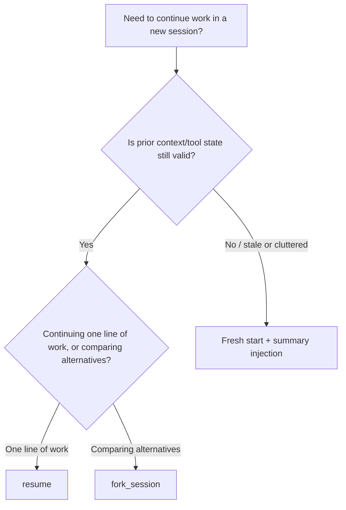

[REF](https://claudecertificationguide.com/learn/1-agentic-architecture/1-7-session-state-resumption)

---
## Comparison Table

| Scenario                                                 | Best Option           | Reasoning                                                        |
| -------------------------------------------------------- | --------------------- | ---------------------------------------------------------------- |
| Continuing work from yesterday, no files changed         | `--resume`            | Prior context is valid, full history is useful                   |
| Comparing two refactoring approaches                     | `fork_session`        | Divergent exploration from shared baseline                       |
| Resuming after modifying 3 of 50 files                   | Fresh start + summary | Stale tool results for modified files would cause contradictions |
| Long session with cluttered history                      | Fresh start + summary | Degraded context benefits from a clean baseline                  |
| Exploring a testing strategy vs a documentation strategy | `fork_session`        | Two independent approaches from the same analysis                |

**Exam Trap**
The exam tests whether you recognise that resuming after file changes can lead to stale context. Simply resuming and asking the agent to re-read changed files is not the best answer — the stale results remain in history and can still influence reasoning. A fresh start with summary injection is more reliable.

## Decision Flow

## Key Concept: The Stale Context Problem

Tool results in conversation history are a **snapshot in time**. If files, APIs, or dependencies change after that snapshot, `resume` will restore reasoning built on outdated facts. This is the trigger condition for choosing **fresh start + summary injection** instead.

### Targeted Re-Analysis vs Full Re-Exploration

When files have changed, the agent does not need to re-analyse the entire codebase. This is wasteful, especially for large codebases where only a few files were modified.

The correct approach is **targeted re-analysis**: inform the agent about the specific files that changed and let it re-analyse only those files. The summary from the prior session covers everything that has not changed.

**What targeted re-analysis looks like in practice:**

1. Start a fresh session.
2. Inject a structured summary: "Prior analysis found X, Y, and Z across the codebase. The following 3 files have been modified since: auth.ts, database.ts, and api-routes.ts."
3. The agent re-reads and re-analyses only the 3 modified files.
4. It combines the fresh analysis of changed files with the preserved summary of unchanged files.

This is faster than full re-exploration and more reliable than resuming with stale context.
